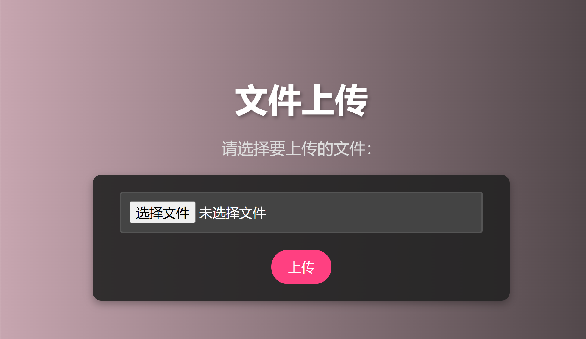
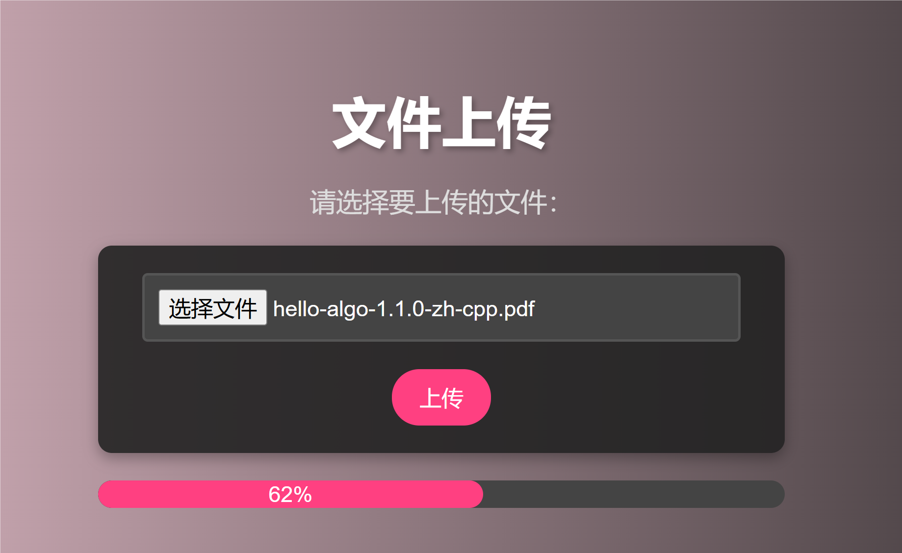
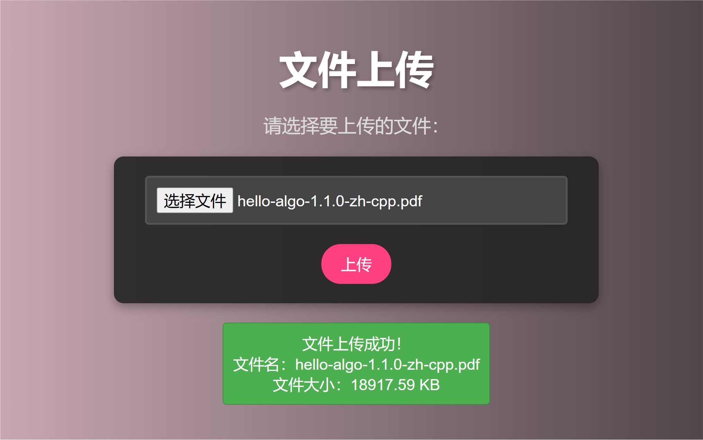

# WebServer

## 相关技术
-  C++11~C++17的一些新特性使用
-  tcp连接, http请求, 响应
-  MVC架构模式：处理任务的模型，返回的视图，控制器彼此松耦合。
-  高并发：使用epoll事件驱动模型, Reactor模式、线程池
-  使用CMake构建程序
-  设计模式：单例模式、工厂模式
-  不依赖外部库实现的反射、日志系统、ini解析、json解析、动态数据类型等
## 已实现GET、POST请求功能演示

### GET请求功能演示
  可根据URL地址访问，并返回相应的页面。
  
### POST请求功能演示(实现了json和file上传功能)

## 各线程工作

1. **主线程 (SocketHandler)**：采用reactor的事件处理模型，使用epoll来监听和处理socket连接，产生特定任务交给任务分发线程。
2. **任务分发线程**：负责接收任务，将任务对接给线程池。
3. **线程池**：管理的一批工作线程，当线程池接到任务时，会调度当前空闲的工作线程来处理任务。

## 从socket连接到处理结束，各组件之间的配合

1. **SocketHandler** 接收到socket连接请求，从 **TaskFactory** 获取一个 **HttpTask**。
2. **SocketHandler** 将 **HttpTask** 交给 **task_dispatcher**，后者将 **HttpTask** 交给线程池。
3. 线程池将 **HttpTask** 分配给工作线程，线程开始进行 **HttpTask** 处理。
4. 在 **HttpTask** 中，接收HTTP请求，并调用 **Web** 组件中的 **Request** 解析，分别解析header和body。
5. **Request** 解析完毕后，交给 **Web** 组件中的 **Server**， **Server** 负责处理 **Request**，自动路由，生成相应的 **Response**。
   - 支持处理的类型有三种：
     - a. 静态绑定处理方法与具体的path。
     - b. 直接请求具体路径的文件，支持html、js、png、jpg等。
     - c. 基于反射注册的控制器和方法，与 **App** 组件交互。
6. **Request** 和 **Response** 中涉及的json文本处理由 **JsonParser** 组件进行。
7. **Response** 生成完毕后，在 **HttpTask** 中发送回客户端。
8. 贯穿始终的动态数据类型、日志、字符串、ini配置文件解析功能等由 **Utility** 组件提供。

**大致的流程图如下**

## 压力测试
  - **RPS:** 使用开源工具[wrk](https://github.com/wg/wrk)测试，测试环境为Ubuntu64虚拟机，相同环境下与nginx进行对比，每秒http请求处理数量(RPS)达到nginx的70%左右。
  - **文件上传:** 经过简单测试，可以稳定上传1.5G以内的文件。